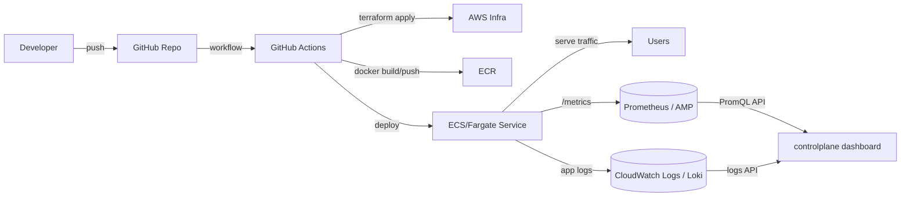
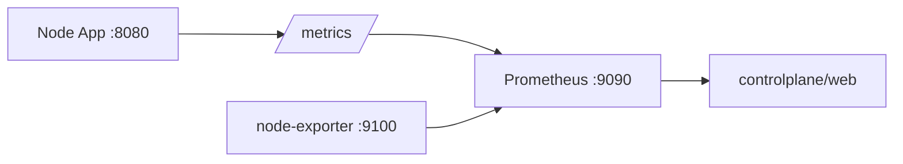

# Controlplane End-to-End 보고서 (Terraform → GitHub Actions → Prometheus → Dashboard)
작성일: 2026-03-18  
대상 워크스페이스: `C:\aws_0318_v4`

## 0. 이 문서의 목적/범위
이 문서는 “인프라를 코드로 만들고(Terraform), 애플리케이션을 컨테이너로 배포(Docker), 배포 자동화(GitHub Actions), 운영 관측(로그/메트릭 수집), 그리고 최종적으로 controlplane 대시보드에서 확인”까지의 **전체 흐름을 다른 담당자가 그대로 재현 가능한 수준**으로 설명합니다.

또한, 이 워크스페이스에 **현재 실제로 구현/검증된 부분**과 **향후 연결해야 하는 부분**을 명확히 구분합니다.

- **현재 구현/검증됨(로컬)**:
  - Node 앱(`aws-test-version/app`)의 `/metrics` Prometheus 노출
  - Prometheus 스크랩 구성(`controlplane/prometheus.yml`)
  - docker-compose 기반 로컬 모니터링 스택(`controlplane/docker-compose.monitoring.yml`)
  - controlplane 대시보드(`controlplane/web`)에서 Prometheus API 조회
  - `AppHttpPage`, `InfraPage`가 더미 데이터가 아닌 Prometheus 실데이터로 표시됨
- **현재 미구현(향후 연결)**:
  - Terraform로 AWS 리소스(ECR/ECS/ALB/SG 등) 실제 구성
  - GitHub Actions로 “빌드 → 푸시 → 배포” 파이프라인 자동화
  - 원격 운영환경에서 Prometheus 수집/보관(원격 Prometheus/AMP 등)
  - “로그”를 controlplane에서 조회(예: CloudWatch Logs, Loki 등 연동)

> 이미 로컬에서는 메트릭 수집/대시보드 표시는 end-to-end로 확인했습니다. 이제 남은 건 이 패턴을 “AWS 운영 배포” + “로그 조회”까지 확장하는 것입니다.

---

## 1. 코드/구성요소 개요(현재 워크스페이스 기준)

### 1-1. 주요 디렉터리
- **Node 앱(메트릭 노출 대상)**: `aws-test-version/app/`
  - `server.js`: HTTP 서버 + `/healthz` + `/metrics` (Prometheus)
  - `package.json`: `prom-client` 의존성 포함
- **Controlplane(대시보드)**: `aws-test-version/controlplane/`
  - `web/`: Vite + React 대시보드
  - `api/`: (현재 비어있음) 향후 “운영에서 Prometheus/GitHub/로그 API 프록시”를 둘 자리
  - `docker-compose.monitoring.yml`: 로컬에서 app/prometheus/node-exporter를 한 번에 띄우는 구성
  - `prometheus.yml`: Prometheus scrape config
  - `PROMETHEUS_DASHBOARD_INTEGRATION_REPORT.md`: Prometheus 연동 변경 내역 보고서(요약/실무 메모)

### 1-2. 로컬에서 실제 실행되는 컴포넌트(컨테이너)
`controlplane/docker-compose.monitoring.yml` 기준으로 아래 컨테이너가 올라옵니다.

- `app` (포트 8080)
- `prometheus` (포트 9090)
- `node-exporter` (포트 9100)

---

## 2. “큰 틀” 아키텍처 (목표 상태)

### 2-1. 목표 상태 구성도(운영)


### 2-2. 이 워크스페이스에서 “지금 당장 확인 가능한” 상태(로컬)


---

## 3. 실행 순서(로컬) — “처음부터 끝까지”

이 섹션은 지금 코드로 **즉시 재현 가능한** 흐름입니다.

### 3-1. (전제) Docker Desktop 정상 동작 확인
PowerShell:

```powershell
docker version
```

### 3-2. 로컬 모니터링 스택 기동
PowerShell:

```powershell
cd C:\aws_0318_v4\aws-test-version\controlplane
docker compose -f docker-compose.monitoring.yml up
```

기동 결과(기대):
- `app`가 `0.0.0.0:8080`로 노출
- `prometheus`가 `0.0.0.0:9090`로 노출
- `node-exporter`가 `0.0.0.0:9100`로 노출

### 3-3. 앱이 메트릭을 노출하는지 확인
아래 URL이 **텍스트 메트릭(# HELP/# TYPE 포함)** 으로 보여야 합니다.

- `http://localhost:8080/metrics`

PowerShell:

```powershell
curl.exe "http://localhost:8080/metrics"
```

#### 3-3-1. 어떤 메트릭이 있어야 하는가(핵심)
- **요청 카운터**: `ecommerce_app_http_requests_total`
- **지연 히스토그램**: `ecommerce_app_http_request_duration_seconds_bucket` (+ `_sum`, `_count`)
- **기본 메트릭(collectDefaultMetrics)**:
  - `ecommerce_app_process_*`
  - `ecommerce_app_nodejs_*`

> 만약 `/metrics`에서 JSON(`{"ok":true...}`)이 나오면, 그 서버는 “메트릭 버전”이 아니라 이전 코드/이전 배포일 가능성이 큽니다.

### 3-4. Prometheus가 스크랩하는지 확인
Prometheus UI:
- `http://localhost:9090`

Targets 확인:
- `Status` → `Targets`
- 아래가 `UP`이어야 정상:
  - `job="ecommerce-app"`, `instance="app:8080"`
  - `job="node"`, `instance="node-exporter:9100"`

CLI 확인(선택):

```powershell
curl.exe -sS "http://localhost:9090/api/v1/query?query=up"
```

### 3-5. 트래픽을 만들어 “실시간 값 반영” 확인
앱에 요청이 거의 없으면 `rate()` 기반 RPS가 0처럼 보일 수 있습니다.
10초 동안 가볍게 트래픽을 만들고, Prometheus 쿼리로 확인합니다.

```powershell
$end=(Get-Date).AddSeconds(10); while((Get-Date) -lt $end){ 1..50 | % { curl.exe -s "http://localhost:8080/" > $null } }
```

RPS 확인:

```powershell
curl.exe -sS "http://localhost:9090/api/v1/query?query=sum(rate(ecommerce_app_http_requests_total%5B1m%5D))"
```

### 3-6. controlplane/web이 Prometheus 데이터를 화면에 표시하는 흐름
`controlplane/web`은 브라우저에서 Prometheus를 직접 호출하지 않고(운영에서 보안/CORS 이슈),
개발환경에서는 Vite 프록시(`/prometheus`)로 Prometheus API를 조회합니다.

- 프록시 설정: `aws-test-version/controlplane/web/vite.config.ts`
  - `/prometheus` → 기본 `http://localhost:9090`

즉, 프론트는 아래처럼 호출합니다.
- `/prometheus/api/v1/query?...`

그리고 Vite dev server가 이를 Prometheus로 전달합니다.

### 3-7. 대시보드에서 어떤 페이지가 실데이터를 보는가
- **App HTTP**: `web/src/pages/AppHttpPage.tsx`
  - 훅: `web/src/hooks/usePrometheusMetrics.ts`
  - PromQL 예시:
    - `sum(rate(ecommerce_app_http_requests_total[1m]))`
    - `histogram_quantile(0.95, sum(rate(ecommerce_app_http_request_duration_seconds_bucket[5m])) by (le)) * 1000`
- **Infra**: `web/src/pages/InfraPage.tsx`
  - 훅: `web/src/hooks/useInfraMetrics.ts`
  - PromQL 예시(node-exporter):
    - CPU: `100 * (1 - avg by (cpu) (rate(node_cpu_seconds_total{mode="idle"}[1m])))`
    - Memory trend: `100 * (1 - (avg(node_memory_MemAvailable_bytes) / avg(node_memory_MemTotal_bytes)))`
    - Disk FS: `node_filesystem_size_bytes`, `node_filesystem_avail_bytes`
    - Disk IO: `sum(rate(node_disk_read_bytes_total[1m])) / 1024 / 1024` (MB/s)

---

## 4. “코드가 시작되고 동작하는 순서” (런타임 관점)

### 4-1. app(server.js) 런타임 흐름
1) Node가 `server.js` 실행 (`npm run start`)
2) 서버가 `0.0.0.0:8080`에 바인딩
3) 각 요청에 대해:
   - 시작 시각을 기록
   - 응답이 끝나는 `finish` 이벤트에서:
     - `ecommerce_app_http_requests_total{method,route,status_code}` 증가
     - `ecommerce_app_http_request_duration_seconds{...}` 히스토그램에 관측값 기록
4) `/metrics` 요청이면:
   - `register.metrics()` 결과(텍스트)를 반환

### 4-2. Prometheus 런타임 흐름
1) `prometheus.yml`를 읽고 scrape job을 구성
2) 15초마다:
   - `app:8080/metrics` 스크랩 → 시계열 저장
   - `node-exporter:9100/metrics` 스크랩 → 시계열 저장
3) HTTP API(`/api/v1/query`, `/api/v1/query_range`)로 PromQL 쿼리 응답

### 4-3. controlplane/web 런타임 흐름
1) `npm run dev`로 Vite dev server 기동
2) 화면에서 페이지 진입 시 훅 실행
   - `usePrometheusMetrics()` / `useInfraMetrics()`
3) 훅 내부에서:
   - `/prometheus/api/v1/query` 또는 `/query_range` 호출(fetch)
   - Prometheus 응답(JSON)을 화면용 데이터 구조로 변환
4) Recharts 컴포넌트들이 변환된 데이터로 렌더링

---

## 5. 운영 확장(미구현) — Terraform + GitHub Actions + “로그”까지 연결하는 표준 절차

이 섹션은 “큰 틀”을 실제 운영으로 확장할 때 필요한 구성입니다. 현재 워크스페이스에는 아직 완성되어 있지 않으며,
향후 작업 시 본 문서를 체크리스트로 사용합니다.

### 5-1. Terraform(Infra as Code)로 구성할 리소스(예시)
- **네트워크**: VPC, Subnet, Route Table, IGW/NAT
- **컨테이너 레지스트리**: ECR Repository
- **배포 런타임**: ECS Cluster, Task Definition, Service
- **트래픽 진입점**: ALB, Target Group, Listener(80/443)
- **보안**: Security Group(인바운드/아웃바운드), IAM Role(Task execution role)
- **로그**: CloudWatch Log Group(ECS 로그 드라이버)
- **메트릭 수집**(선택):
  - 자체 Prometheus를 ECS/K8s에 운영하거나
  - AWS Managed Prometheus(AMP) 사용

### 5-2. Docker 이미지(운영 빌드) 구성
운영 배포를 위해서는 `aws-test-version/app`에 일반적으로 아래가 필요합니다.
- `Dockerfile`
- (선택) `.dockerignore`

그리고 GitHub Actions가:
1) Docker build
2) ECR push
3) ECS deploy
를 수행합니다.

### 5-3. GitHub Actions로 배포 자동화(표준)
운영에서 권장되는 인증 방식은 **OIDC**입니다.

- GitHub → AWS AssumeRole(단, repo/branch 제한)
- Actions 단계:
  - checkout
  - configure-aws-credentials(OIDC)
  - ecr login
  - docker build/push
  - ecs task-def render
  - ecs deploy + 안정화 대기

### 5-4. “로그”를 대시보드에서 보는 방법(설계 포인트)
Prometheus는 **메트릭** 중심입니다. “로그”는 별도의 저장소가 필요합니다.

대표 선택지:
- **CloudWatch Logs**(ECS 기본)
- **Loki**(Grafana stack)
- **OpenSearch**(로그 검색)

controlplane에서 로그를 보려면, 프론트가 외부 로그 시스템을 직접 호출하기보다는
`controlplane/api` 같은 백엔드에서 **프록시/권한부여/집계**를 수행하는 패턴을 권장합니다.

예:
- `GET /api/logs?service=app&since=5m`
- 내부에서 CloudWatch Logs Insights 또는 Loki API 호출

---

## 6. 트러블슈팅(실제 발생/자주 발생)

### 6-1. `/metrics`가 JSON으로 나온다
의미:
- 현재 실행 중인 서버는 “Prometheus 메트릭 노출 버전(server.js 수정)”이 아닐 가능성이 큼

해결:
- 로컬: docker-compose가 최신 볼륨을 마운트했는지 확인 후 재기동
- 원격(ECS/EC2): 새 이미지 빌드/배포가 반영되었는지 확인(태스크 교체/서비스 재배포)

### 6-2. Prometheus 쿼리가 빈 배열(result=[])이다
의미:
- 트래픽이 없어서 rate가 0이거나, 스크랩이 아직 시작되지 않았거나, 메트릭 이름이 다름

해결:
- 짧게 트래픽 발생(섹션 3-5)
- Targets에서 UP 확인
- `/metrics`에서 메트릭 이름 실제 존재 확인

### 6-3. 프론트에서 Prometheus 호출이 실패한다(CORS 등)
해결:
- 개발환경: `/prometheus` 프록시를 통해 접근(vite.config.ts)
- 운영: 프론트 직접 호출 대신 백엔드 프록시(`/api/metrics/*`) 권장

---

## 7. 현재 상태 요약(2026-03-18 기준)
- **로컬**: “메트릭 노출 → Prometheus 수집 → controlplane 표시” end-to-end 성공
- **대시보드**:
  - `AppHttpPage`: Prometheus 기반 실데이터
  - `InfraPage`: node-exporter 기반 실데이터
  - `GitActionsPage`, `PolicyPage`, `SecurityPage`, `AwsResourcePage`: 아직 mock 기반(추후 GitHub API/CloudWatch/Exporter 연동 필요)

---

## 8. 참고 파일(로컬 구현에 직접 관련된 것)
- `aws-test-version/controlplane/docker-compose.monitoring.yml`
- `aws-test-version/controlplane/prometheus.yml`
- `aws-test-version/app/server.js`
- `aws-test-version/app/package.json`
- `aws-test-version/controlplane/web/src/lib/prometheus.ts`
- `aws-test-version/controlplane/web/src/hooks/usePrometheusMetrics.ts`
- `aws-test-version/controlplane/web/src/hooks/useInfraMetrics.ts`
- `aws-test-version/controlplane/web/src/pages/AppHttpPage.tsx`
- `aws-test-version/controlplane/web/src/pages/InfraPage.tsx`

