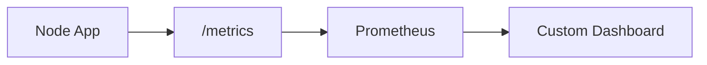

# Prometheus 대시보드 연동 보고서

## 1. 목표
기존 대시보드(`controlplane/web`)가 Prometheus에서 수집한 메트릭을 읽어서 화면에 보여주도록 연결했습니다.

이 작업의 핵심은 다음 3가지입니다.

- 앱이 메트릭을 내보내기
- Prometheus가 그 메트릭을 수집하기
- 대시보드가 Prometheus API를 읽어서 표시하기

## 2. 이번에 바꾼 것

### 2-1. 앱 메트릭 노출
이전에는 앱이 단순히 텍스트/JSON만 응답했지만, 이제는 다음 메트릭을 `/metrics`에서 노출합니다.

- `ecommerce_app_http_requests_total`
- `ecommerce_app_http_request_duration_seconds`
- `ecommerce_app_process_*`
- `ecommerce_app_nodejs_*`

즉, 앱이 “내가 지금 얼마나 바쁘고, 얼마나 느린지”를 숫자로 직접 보여줍니다.

#### 2-1-1. 로컬 앱 코드 변경(대상)
로컬 테스트/개발을 위한 메트릭 노출 대상 앱은 다음 경로입니다.

- `aws-test-version/app/server.js` (기본 포트: `8080`)

추가/변경된 핵심 사항:

- `prom-client`로 Counter/Histogram 생성
- `/metrics`에서 Prometheus 텍스트 포맷으로 노출
- 모든 요청에 대해 `ecommerce_app_http_requests_total`, `ecommerce_app_http_request_duration_seconds` 기록

> 참고: 원격 서버에서 `/metrics`가 JSON으로 보인다면, 그 서버는 위 변경사항이 반영되지 않은 “이전 배포/이전 이미지”일 가능성이 큽니다.

### 2-2. Prometheus 수집
Prometheus는 앱의 `/metrics`를 주기적으로 가져가도록 설정했습니다.

- 로컬 테스트 기준: `app:8080/metrics`
- 수집 주기: 15초

### 2-3. 대시보드 연동
대시보드(`web`)는 이제 Prometheus HTTP API를 읽어서 실제 메트릭을 표시합니다.

- 요청 수
- 4xx / 5xx 에러
- 응답 시간 P50 / P95 / P99
- 엔드포인트별 요청 추이

### 2-4. (추가) Infra 페이지 실메트릭 전환
`InfraPage`는 더미 데이터 대신 `node-exporter`를 Prometheus가 수집한 값을 사용합니다.

- docker-compose에 `node-exporter(9100)` 컨테이너 추가
- Prometheus 스크랩 타겟에 `job="node"` 추가
- 대시보드(`web`)에서 CPU/메모리/디스크 추이를 PromQL로 조회

## 3. 왜 이렇게 구성했는가
Prometheus는 로그 수집기라기보다 **메트릭 수집기**입니다.

그래서 구조를 이렇게 나눴습니다.



이 구조의 장점은:

- 대시보드가 Prometheus에서 직접 숫자를 읽을 수 있음
- Grafana 없이도 자체 화면을 만들 수 있음
- 나중에 AWS 운영 환경으로 옮기기 쉬움

## 4. 수정한 파일

### 대시보드 쪽
- [`web/src/lib/prometheus.ts`](web/src/lib/prometheus.ts)
  - Prometheus HTTP API 호출 함수 추가
- [`web/src/hooks/usePrometheusMetrics.ts`](web/src/hooks/usePrometheusMetrics.ts)
  - Prometheus에서 받은 값을 화면용 데이터로 변환
- [`web/src/pages/AppHttpPage.tsx`](web/src/pages/AppHttpPage.tsx)
  - mock data 대신 실시간 메트릭 표시
- [`web/src/components/charts/RequestTrendChart.tsx`](web/src/components/charts/RequestTrendChart.tsx)
  - 고정 라벨 차트를 Prometheus 라벨 기반 차트로 변경
- [`web/vite.config.ts`](web/vite.config.ts)
  - `/prometheus` 프록시 설정 추가

- [`web/src/hooks/useInfraMetrics.ts`](web/src/hooks/useInfraMetrics.ts)
  - node-exporter 기반 인프라 메트릭을 Prometheus에서 조회하는 훅
- [`web/src/pages/InfraPage.tsx`](web/src/pages/InfraPage.tsx)
  - mock data 대신 실시간 인프라 메트릭 표시

### 앱(메트릭 노출 대상)
- [`../app/server.js`](../app/server.js)
  - `/metrics` 및 `ecommerce_app_*` 메트릭 노출 추가
- [`../app/package.json`](../app/package.json)
  - `prom-client` 의존성 추가

### 모니터링 스택(로컬)
- [`docker-compose.monitoring.yml`](docker-compose.monitoring.yml)
  - `app(8080)`, `prometheus(9090)`, `node-exporter(9100)` 실행
- [`prometheus.yml`](prometheus.yml)
  - `job="ecommerce-app"`(app:8080) 및 `job="node"`(node-exporter:9100) 스크랩

### 로컬 테스트용
- [`web/src/pages/AppHttpPage.tsx`](web/src/pages/AppHttpPage.tsx)
  - 실시간 상태/에러 표시 추가
- Prometheus 프록시 경로:
  - 브라우저에서는 `/prometheus/...`
  - Vite 개발 서버가 `http://localhost:9090`으로 전달

## 5. 실제로 어떻게 확인하는가

### 앱 확인
- `http://localhost:8080/`
- `http://localhost:8080/healthz`
- `http://localhost:8080/metrics`

### Prometheus 확인
- `http://localhost:9090`
- 예시 쿼리:

```promql
ecommerce_app_http_requests_total
```

```promql
rate(ecommerce_app_http_requests_total[1m])
```

```promql
histogram_quantile(0.95, rate(ecommerce_app_http_request_duration_seconds_bucket[5m]))
```

#### 5-1. Targets 상태 확인(스크랩 정상 여부)
Prometheus UI에서 다음으로 이동:

- `Status` → `Targets`

정상이라면 아래 두 타겟이 `UP` 상태입니다.

- `job="ecommerce-app"`, `instance="app:8080"`
- `job="node"`, `instance="node-exporter:9100"`

CLI로도 확인할 수 있습니다.

```powershell
curl.exe -sS "http://localhost:9090/api/v1/query?query=up"
```

### 대시보드 확인
대시보드는 `/prometheus/api/v1/...` 경로를 통해 Prometheus 데이터를 읽습니다.

예:

```text
/prometheus/api/v1/query?query=ecommerce_app_http_requests_total
```

## 6. 로컬 실행 방법
```powershell
cd controlplane
docker compose -f docker-compose.monitoring.yml up
```

이 명령으로:

- 앱 컨테이너
- Prometheus 컨테이너

를 함께 올려서 바로 확인할 수 있습니다.

### 6-1. 포함된 로컬 구성 파일
`controlplane` 폴더에 다음 파일을 포함합니다.

- `docker-compose.monitoring.yml`
  - 로컬에서 `app(8080)` + `prometheus(9090)`를 같이 실행합니다.
  - 추가로 `node-exporter(9100)`도 포함합니다.
- `prometheus.yml`
  - Prometheus가 `app:8080/metrics`를 15초마다 스크랩하도록 설정합니다.
  - Prometheus가 `node-exporter:9100/metrics`도 스크랩하도록 설정합니다.

### 6-2. 확인 URL
- App: `http://localhost:8080/`
- App Health: `http://localhost:8080/healthz`
- App Metrics: `http://localhost:8080/metrics`
- Prometheus UI: `http://localhost:9090`

### 6-3. 트래픽을 발생시켜 RPS 상승을 눈으로 확인하는 방법(Windows PowerShell)
대시보드에서 실시간 반영을 확인하려면, 앱으로 트래픽을 조금 발생시킨 뒤 Prometheus 쿼리를 확인합니다.

#### 6-3-1. 10초 동안 “살짝” 부하 주기(자동 종료)
```powershell
$end=(Get-Date).AddSeconds(10); while((Get-Date) -lt $end){ 1..50 | % { curl.exe -s "http://localhost:8080/" > $null } }
```

#### 6-3-2. RPS 쿼리로 값 확인
```powershell
curl.exe -sS "http://localhost:9090/api/v1/query?query=sum(rate(ecommerce_app_http_requests_total%5B1m%5D))"
```

> PowerShell에서는 `> NUL` 리다이렉션이 환경에 따라 오류가 날 수 있어, 출력 버리기는 `> $null`을 사용합니다.

### 6-4. 종료 방법
```powershell
cd controlplane
docker compose -f docker-compose.monitoring.yml down
```

## 7. 참고한 점
- Prometheus는 로그가 아니라 메트릭을 보여줍니다.
- 브라우저에서 직접 Prometheus를 호출하면 CORS 문제가 생길 수 있어서, Vite 프록시를 사용했습니다.
- 운영 환경에서는 `/prometheus` 경로를 실제 Prometheus 주소로 프록시해주는 서버 또는 게이트웨이가 필요합니다.

## 8. AWS 배포 주소(접속 URL) 확인 절차 메모
대화 중 확인된 사항:

- AWS ECS 콘솔에서 클러스터 목록에 `ecs-minimal-sample-cluster`가 존재함

배포된 서비스의 “실제 접속 주소”는 구성에 따라 다릅니다.

### 8-1. ALB(로드밸런서)를 붙인 경우
- ECS → `Cluster` → `Service` → Service 상세
- `Load balancers` / `Networking` 섹션에 **ALB DNS**가 표시됩니다.
- 접속은 보통 `http://<ALB-DNS>/` 또는 리스너 포트/경로 설정에 따릅니다.

### 8-2. 로드밸런서 없이 Public IP로 붙는 경우(태스크 직결)
- ECS → `Cluster` → `Tasks` → 실행 중인 Task 클릭
- 네트워크 섹션에서 **Public IP** 확인
- 접속: `http://<Public-IP>:8080/` (포트는 태스크/SG 설정에 따름)

### 8-3. “이전 배포 주소인지” 헷갈릴 때의 판별
`/metrics`가 Prometheus 텍스트(예: `# HELP ...`)가 아니라 JSON으로 보이면,
해당 서버는 현재 로컬 변경사항(`/metrics` 구현, prom-client 계측)이 반영되지 않은 배포일 가능성이 큽니다.

## 8. 결론
이제 대시보드는 Prometheus에서 수집한 실시간 메트릭을 읽어서 화면에 보여줄 수 있습니다.

다음 확장 방향은:

- AWS 배포 환경에서도 같은 방식으로 `/prometheus` 프록시를 붙이기
- 알람 규칙 추가하기
- 요청/에러/지연 시간을 더 세분화해서 보여주기

